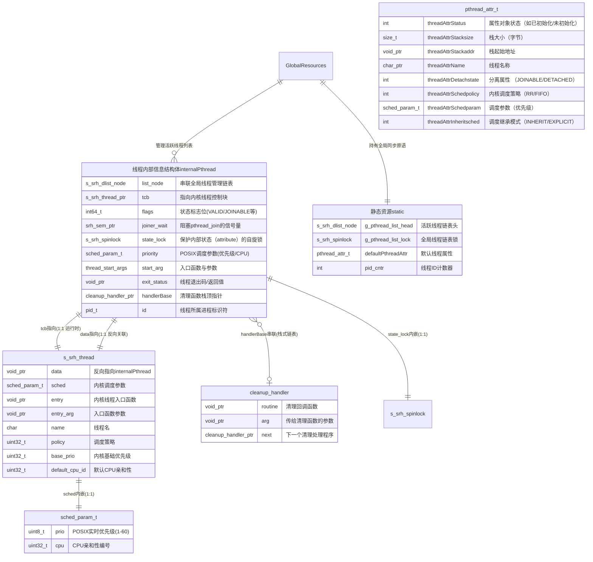

# pthread模块的详细设计

## 1.模块概述

## 2.模块接口

### 2.1对外接口

### 2.2调用关系

## 3.模块设计原理

### 3.1设计原理

### 3.2资源关系

## 4.核心API接口

### 4.1`pthread_create`

#### 1.API原型

#### 2.参数说明

#### 3.实现流程

##### 1.正常执行流图

##### 2.详细流程图

### 4.2 `pthread_cancel`

#### 1.API原型

#### 2.参数说明

#### 3.实现流程

##### 1.正常执行流图

##### 2.详细流程图