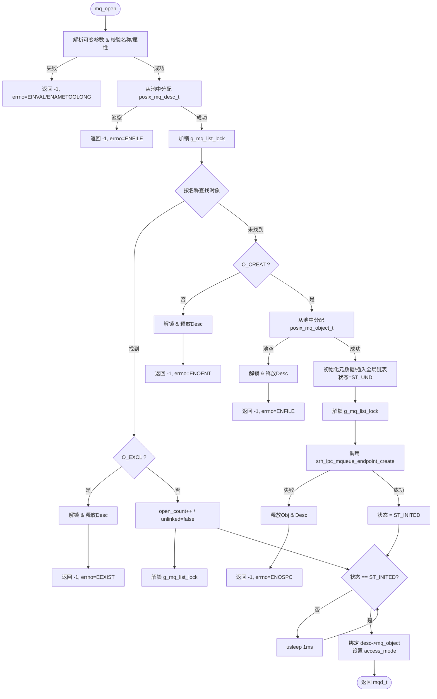
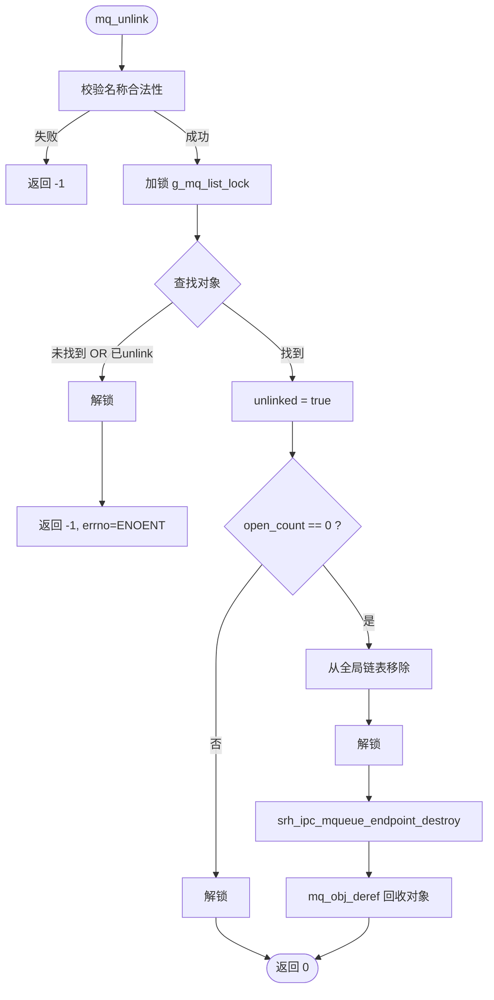
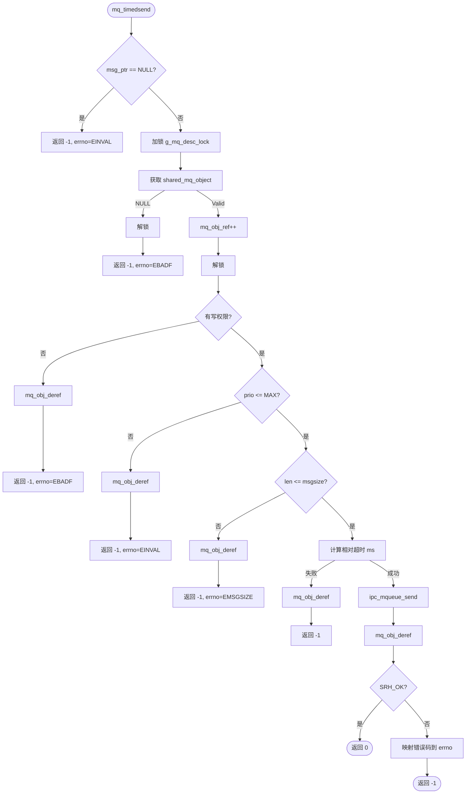

POSIX 消息队列实现。该代码采用了**对象池（Object Pool）**模式来管理内存，避免动态分配带来的碎片和不确定性，同时使用了**双层锁机制**（全局列表锁 + 对象状态锁）来保证并发安全。

以下是对 `mq_open`、`mq_unlink` 和 `mq_timedsend` 的详细实现分析及流程图。

---

### 1. `mq_open` 实现分析

#### 核心逻辑

`mq_open` 负责创建或打开一个命名消息队列。它涉及两个层面的资源分配：

1. **描述符层 (`posix_mq_desc_t`)**: 线程私有，代表一次“打开”操作。
2. **对象层 (`posix_mq_object_t`)**: 系统全局共享，代表实际的消息队列实体。

#### 关键步骤

1. **参数解析与校验**:
   - 处理可变参数（`mode`, `attr`）。
   - 校验名称合法性（`posix_mq_validate_name`）。
   - 校验属性（`mq_maxmsg`, `mq_msgsize`）及访问模式（`O_RDONLY/W/RDWR`）。
2. **预分配描述符**:
   - 在进入全局锁之前，先从 `g_mq_desc_free_head` 池中分配一个描述符。**优化点**：减少持有全局锁的时间。
3. **查找或创建对象 (临界区)**:
   - 加锁 `g_mq_list_lock`。
   - **若存在**: 检查 `O_EXCL`；增加 `open_count`。
   - **若不存在**:
     - 检查 `O_CREAT`。
     - 从 `g_mq_free_head` 分配对象。
     - 初始化对象元数据，插入全局链表。
     - **注意**: 此时对象状态为 `ST_UND`，且已释放全局锁。
4. **内核资源创建 (非临界区)**:
   - 调用 `srh_ipc_mqueue_endpoint_create` 创建底层 IPC 队列。
   - 成功后将状态置为 `ST_INITED`。
5. **同步等待**:
   - `while (mq_object->mq_st < ST_INITED)` 自旋等待。这是为了防止并发创建时，其他线程拿到了对象指针但内核队列尚未就绪。
6. **绑定与返回**:
   - 将描述符指向对象，设置访问权限，返回描述符指针作为 `mqd_t`。

#### ⚠️ 潜在风险/改进点

- **初始化竞态**: 在创建分支中，`srh_dlist_insert_tail` 后释放了锁，然后才创建内核队列。虽然有 `ST_UND` 状态保护，但如果创建失败，对象已经在全局链表中被标记为 `ST_UND` 且未移除，可能导致后续同名打开永久阻塞在 `while` 循环或拿到无效对象。建议在创建失败时重新加锁移除节点。
- **忙等待**: `usleep(1000)` 是硬编码的轮询，实时性较差。

#### `mq_open` 流程图

---

### 2. `mq_unlink` 实现分析

#### 核心逻辑

`mq_unlink` 实现 POSIX 语义的“延迟删除”。它不直接销毁资源，而是标记 `unlinked=true`。只有当 `open_count == 0` 且 `unlinked == true` 时，才真正销毁内核队列并回收对象。

#### 关键步骤

1. **名称校验**: 确保名称合法。
2. **查找与标记 (临界区)**:
   - 加锁 `g_mq_list_lock`。
   - 查找对象，若不存在或已 unlink，返回 `ENOENT`。
   - 设置 `unlinked = true`。
3. **条件销毁判断**:
   - 在同一把锁内检查 `open_count == 0`。
   - 若满足，从全局链表移除节点，标记 `found_and_removed = true`。
4. **资源回收 (非临界区)**:
   - 若 `found_and_removed` 为真：
     - 销毁内核队列 `srh_ipc_mqueue_endpoint_destroy`。
     - 调用 `mq_obj_deref` 减少引用计数（通常归零后回收到对象池）。

#### 💡 设计亮点

- **原子性检查**: `unlinked` 的设置和 `open_count` 的检查都在 `g_mq_list_lock` 保护下完成，避免了“最后一个 close 发生在 unlink 标记之后但检查之前”的竞态条件。

#### `mq_unlink` 流程图

---

### 3. `mq_timedsend` 实现分析

#### 核心逻辑

`mq_timedsend` 是带超时的发送接口。它将 POSIX 的绝对时间转换为 RTOS 内核所需的相对超时（ticks/ms），并进行严格的权限和参数校验。

#### 关键步骤

1. **描述符有效性验证**:
   - 加锁 `g_mq_desc_lock`。
   - 通过 `mq_desc_find_locked` (此处宏定义为直接强转，**存在安全隐患**) 获取描述符。
   - 增加对象引用计数 `mq_obj_ref`，防止在操作期间对象被销毁。
2. **权限与参数校验**:
   - 检查写权限 (`O_WRONLY` | `O_RDWR`)。
   - 检查优先级 `msg_prio <= MQ_PRIO_MAX`。
   - 检查消息长度 `msg_len <= mq_msgsize`。
3. **超时计算**:
   - 调用 `calculate_relative_timeout_ms`。
   - 处理 `O_NONBLOCK` (超时=0)、`NULL abstime` (永久等待)、以及绝对时间转相对时间的逻辑。
4. **内核发送**:
   - 调用 `ipc_mqueue_send`。
5. **结果处理**:
   - 成功返回 0。
   - 失败时将 SRH 错误码映射为 POSIX errno。
   - **最后执行 `mq_obj_deref`**，确保引用计数平衡。

#### ⚠️ 关键安全警告

代码中 `#define mq_desc_find_locked(handle) (posix_mq_desc_t *)handle` 是一个**极其危险**的实现。它假设传入的 `mqd_t` 永远是有效指针。如果用户传入野指针或已关闭的描述符，系统将直接访问非法内存导致 HardFault。标准做法应遍历 `g_mq_desc_free_head` 或使用 ID 索引进行合法性验证。

#### `mq_timedsend` 流程图

