# 消息队列(mqueue)模块的详细设计

## 1.模块概述说明

用户使用场景/意义：

## 2.模块接口

### 2.1对外接口

| 接口名称              | 功能描述                   | 备注                                     |
| --------------------- | -------------------------- | ---------------------------------------- |
| `mq_open`             | 打开或创建命名消息队列     | 支持`O_CREAT, O_EXCL, O_NONBLOCK `等标志 |
| `mq_close`            | 关闭消息队列描述符         | 减少引用计数，可能触发延迟销毁           |
| `mq_unlink`           | 移除消息队列名称           | 标记删除，实际销毁推迟至最后描述符关闭   |
| `mq_send`             | 向消息队列发送消息（阻塞） | mq_timedsend 的无超时封装                |
| `mq_timedsend`        | 带超时的消息发送           | 核心发送实现，接受绝对超时时间           |
| `mq_receive`          | 从消息队列接收消息（阻塞） | mq_timedreceive 的无超时封装             |
| `mq_timedreceive`     | 带超时的消息接收           | 核心接收实现，返回实际接收字节数         |
| `mq_getattr`          | 获取消息队列当前属性       | 返回 flags, maxmsg, msgsize, curmsgs     |
| `mq_setattr`          | 设置消息队列属性           | 仅允许修改 O_NONBLOCK 标志               |
| `_mqueue_module_init` | 模块初始化                 | 初始化全局链表、锁及预分配对象/描述符池  |

### 2.2调用关系

## 3.模块设计原理

### 1.设计原理：

​	描述符和对象分离思想的设计模式

1. 对象：`posix_mq_object_t` 系统级共享的实体（唯一）

2. 描述符：`posix_mq_desc_t`线程级（多个线程描述符可以映射同一个对象：对应多线程对同一消息队列的多次打开）

3. 静态池：
   
   1. `g_mq_list_head`：活跃对象池：串联管理有效的消息队列
   
   2. `g_mq_free_head`：空闲对象池：分配可用的消息队列
   
   3. 同一时刻`posix_mq_object_t`中的`list_node`只属于其中一个

4. 描述符池：`g_mq_desc_free_head`:管理可用描述符

### 2.资源关系

#### 1.结构关系列表

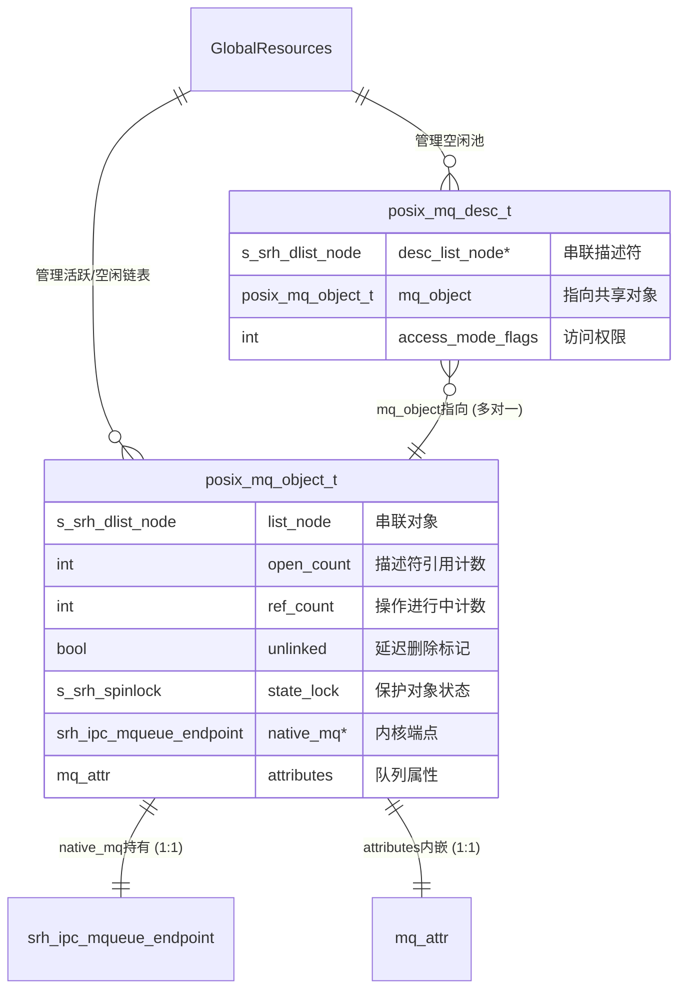

#### 2.结构关系框图

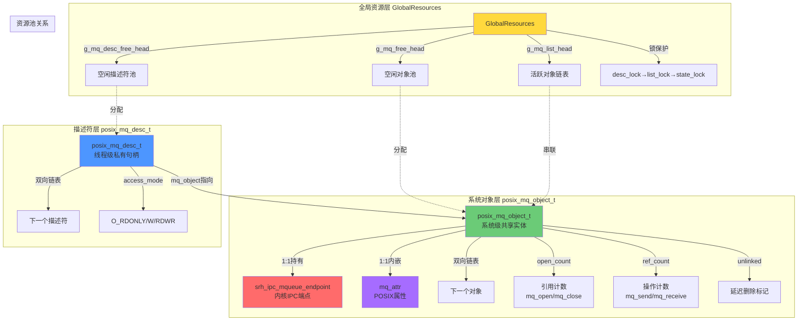

### 3.1`mq_open`

#### 1.API原型

```c
#include <mqueue.h>
#include <sys/stat.h>   /* For mode constants */
#include <fcntl.h>      /* For O_* constants */mqd_t 

mqt_t mq_open(const char *name, int oflag);

mqd_t mq_open(const char *name, int oflag, mode_t mode, struct mq_attr *attr);

eg:
mqd_t mqdes = mq_open(“test_mq”, O_CREAT | O_RDWR, 0x777, &attr);
```

#### 2.参数说明

| 项目         | 描述                                                                                                                                                                                                                                  |
| ---------- | ----------------------------------------------------------------------------------------------------------------------------------------------------------------------------------------------------------------------------------- |
| 函数功能       | 打开或创建一个 POSIX **命名**消息队列。返回一个消息队列描述符，用于后续的发送、接收及关闭操作。若指定了创建标志且队列不存在，则根据 `mode` 和 `attr` 创建新队列；若已存在且未指定排他标志，则直接打开。                                                                                                                   |
| 参数 `name`  | 消息队列名称字符串。不同进程通过相同名称访问同一队列。                                                                                                                                                                                                         |
| 参数 `oflag` | 操作标志位组合：<br>• `O_RDONLY`: 只读（仅接收）<br>• `O_WRONLY`: 只写（仅发送）<br>• `O_RDWR`: 读写<br>• `O_CREAT`: 队列不存在时创建,附加两个参数：mode和attr<br/>• `O_EXCL`: 配合 `O_CREAT` 使用，若队列已存在则失败<br>• `O_NONBLOCK`: 非阻塞模式：队列为空时的读和队列为满时的写不被阻塞。                      |
| 参数 `mode`  | 权限掩码（如 `0644`），仅在创建新队列时有效，定义队列文件的访问权限。                                                                                                                                                                                              |
| 参数 `attr`  | 指向 `struct mq_attr` 的指针，指定队列属性（最大消息数、最大消息大小、优先级等）。传 `NULL` 时使用系统默认值。仅在创建新队列时生效。                                                                                                                                                     |
| 返回值        | 成功返回消息队列描述符 (`mqd_t`)；失败返回 `(mqd_t)-1` 并设置 `errno`。                                                                                                                                                                                 |
| 错误码        | • EACCES: 权限不足或 name 格式非法<br/>• EEXIST: O_CREAT \| O_EXCL 下队列已存在<br/>• ENOENT: 未指定 O_CREAT 且队列不存在<br/>• EINVAL: name 无效、attr 中字段非法或超出系统限制<br/>• EMFILE/ENFILE: 进程或系统级描述符耗尽<br/>• ENAMETOOLONG: name 长度超限<br/>• ENOMEM: 内核内存不足无法创建队列 |
| 注意事项       | •编译命令包含 -lrt                                                                                                                                                                                                                        |
| 使用场景       | POSIX 进程间通信（IPC）中基于消息队列的数据交换；实时系统中任务间异步消息传递；需要持久化命名队列（内核级生命周期）的场景。                                                                                                                                                                  |

#### 3.实现流程

##### 1.实现流程简图

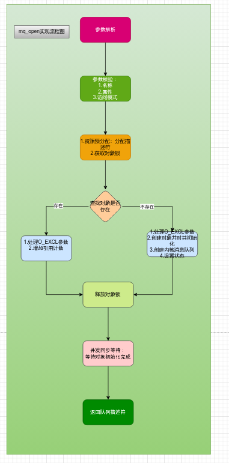

##### 2.详细流程图

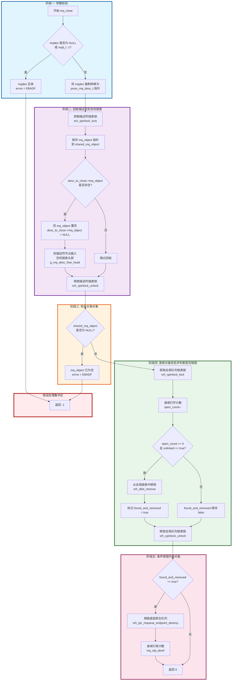

### 3.2`mq_close`

#### 1.API原型

```c
#include <mqueue.h>

int mq_close(mqd_t mqdes);
```

#### 2.参数说明

| 项目         | 描述                                                                            |
| ---------- | ----------------------------------------------------------------------------- |
| 函数功能       | 关闭一个 POSIX 消息队列描述符，释放该描述符占用的进程资源。**注意：它不会删除消息队列本身，队列及其中的未读消息在内核中继续存在。**       |
| 参数 `mqdes` | 由 `mq_open()` 成功返回的消息队列描述符。                                                   |
| 返回值        | 成功返回 `0`；失败返回 `-1` 并设置 `errno`。                                               |
| 错误码        | `EBADF`：无效描述符                                                                 |
| 注意事项       | •关闭 ≠ 删除，`mq_close` 仅解除当前进程与该队列的关联，消息队列仍驻留内核。                                 |
| 使用场景       | 进程完成对某消息队列的读写操作后释放描述符；多进程协作中某个进程退出前清理自身资源；配合 `mq_unlink()` 实现"先关闭再删除"的安全销毁流程。 |

#### 3.实现流程

##### 1.实现流程简图

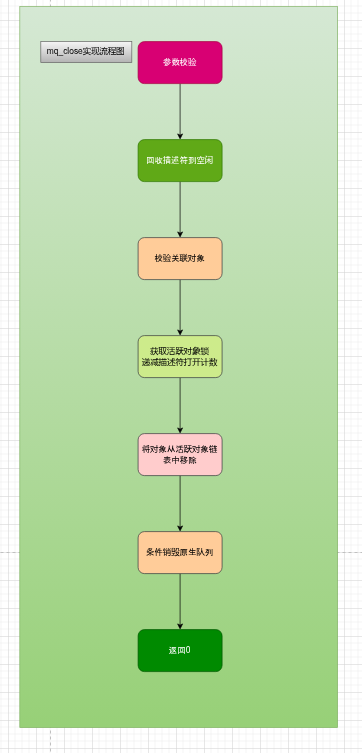

##### 2.详细流程图

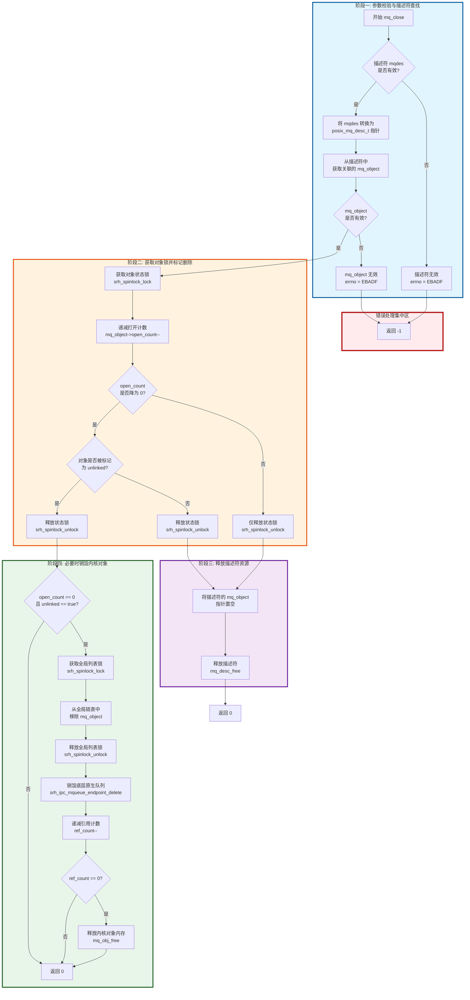

### 3.3`mq_unlink`

#### 1. API原型

```c
#include <mqueue.h>

int mq_unlink(const char *name);
```

#### 2.参数说明

| 项目        | 描述                                                         |
| ----------- | ------------------------------------------------------------ |
| 函数功能    | 删除指定名称的 POSIX 消息队列。该操作仅移除队列的命名引用（类似文件系统的 unlink），不会立即销毁队列。当所有已打开该队列的描述符都被关闭后，内核才真正回收队列资源及其中未读的消息。 |
| 参数 `name` | 要删除的消息队列名称。格式要求与 `mq_open` 一致              |
| 返回值      | 成功返回 `0`；失败返回 `-1` 并设置 `errno`。                 |
| 错误码      | • `EINVAL`:无效指针<br />• `ENOENT`:队列不存在<br />• `ENAMETOOLONG`：name参数过长 |
| 注意事项    | • unlink ≠ 立即销毁<br />• 不影响已打开的描述符<br />•与`mq_close`的销毁条件相同，执行顺序 |
| 使用场景    | 消息队列生命周期结束时彻底销毁队列；程序异常退出后的清理逻辑；防止重启时因残留队列导致 `O_CREAT | O_EXCL` 创建失败。 |
| 核心语义    | mq_unlink 做的事：<br/>  1. 设置 unlinked = true（标记为“待删除”）<br/>  2. 阻止新的 mq_open 找到这个队列<br/>  3. 如果当前无人使用（open_count == 0），立即销毁<br/>  4. 如果还有人使用（open_count > 0），等最后一个 mq_close 来销毁 |

#### 3.处理流程

##### 1.实现流程简图

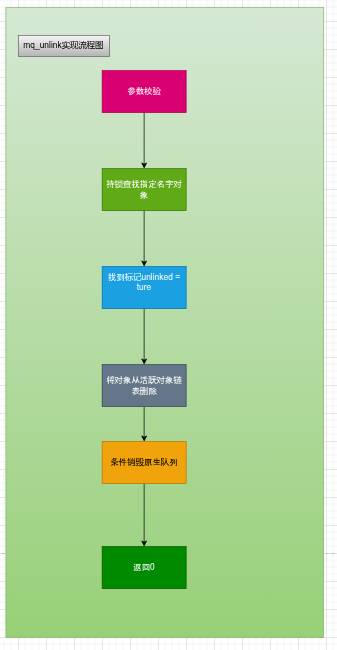

##### 2.详细流程图

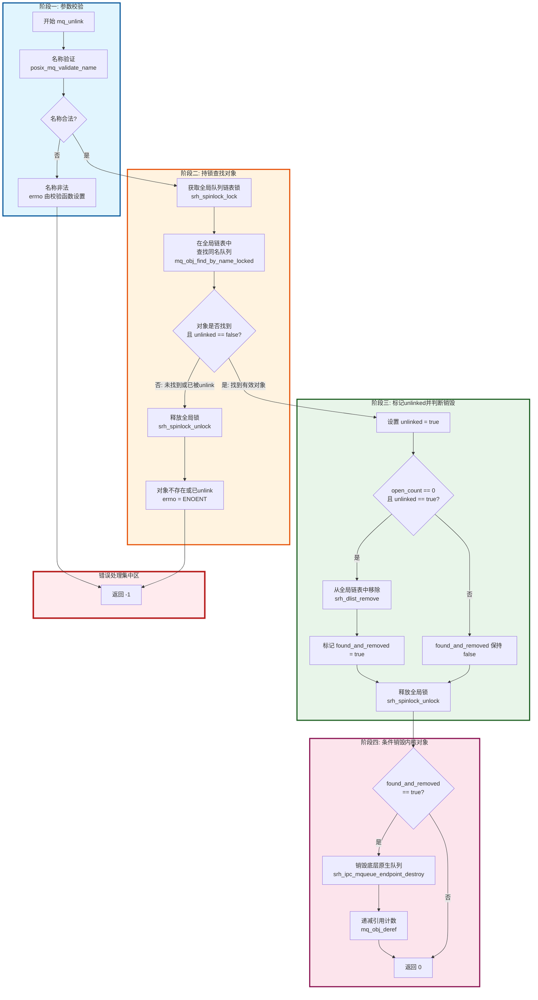


### 3.4`mq_timedsend`

#### 1.API原型

```c
#include <mqueue.h>
#include <time.h>

int mq_timedsend(mqd_t mqdes,
                 const char *msg_ptr,
                 size_t msg_len,
                 unsigned int msg_prio,
                 const struct timespec *abstime);
```

#### 2.参数说明

| 项目            | 描述                                                         |
| --------------- | ------------------------------------------------------------ |
| 函数功能        | 向 POSIX 消息队列发送一条带优先级的消息。当队列满时，阻塞等待直到有空间或到达指定的绝对超时时间。相比 `mq_send`，它提供了精确的超时控制能力，避免无限期阻塞。 |
| 参数 `mqdes`    | 由 `mq_open()` 返回的消息队列描述符，必须以写或读写模式打开。 |
| 参数 `msg_ptr`  | 指向待发送消息数据的缓冲区指针。数据会被完整拷贝到内核队列中。 |
| 参数 `msg_len`  | 消息字节长度。必须 ≤ 创建队列时指定的 `mq_msgsize`，否则调用失败。 |
| 参数 `msg_prio` | 消息优先级（0 ~ 31）。数值越大优先级越高；相同优先级按 FIFO 排序。接收端总是先获取最高优先级的消息。 |
| 参数 `abstime`  | 指向 `struct timespec` 的指针，指定绝对截止时间（CLOCK_REALTIME）。若当前时间已超过该值且队列仍满，则立即返回超时错误。传 `NULL` 等价于无限阻塞（行为同 `mq_send`）。 |
| 返回值          | 成功返回 `0`；失败返回 `-1` 并设置 `errno`。注意：返回 0 仅表示消息已入队，不代表已被接收方读取。 |
| 错误码          | • `EAGAIN`: 队列已满且设置了 O_NONBLOCK<br/>• `EBADF`: 描述符无效或未以写模式打开<br/>• `EINTR`: 等待期间被信号中断<br/>• `EINVAL`: msg_len 超限、优先级非法、abstime 无效或指针为空<br/>• `ETIMEDOUT`: 在截止时间前仍无法入队（超时）<br/>• `EMSGSIZE`: 消息长度超过系统允许的最大值 |
| 注意事项        |                                                              |
| 使用场景        | 实时系统中需要严格时限保证的消息发送；生产者-消费者模型中防止发送端因队列满而死锁；需要区分消息紧急程度的调度场景。 |

#### 3.实现流程

##### 1.实现流程简图

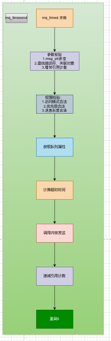

##### 2.详细实现流程图

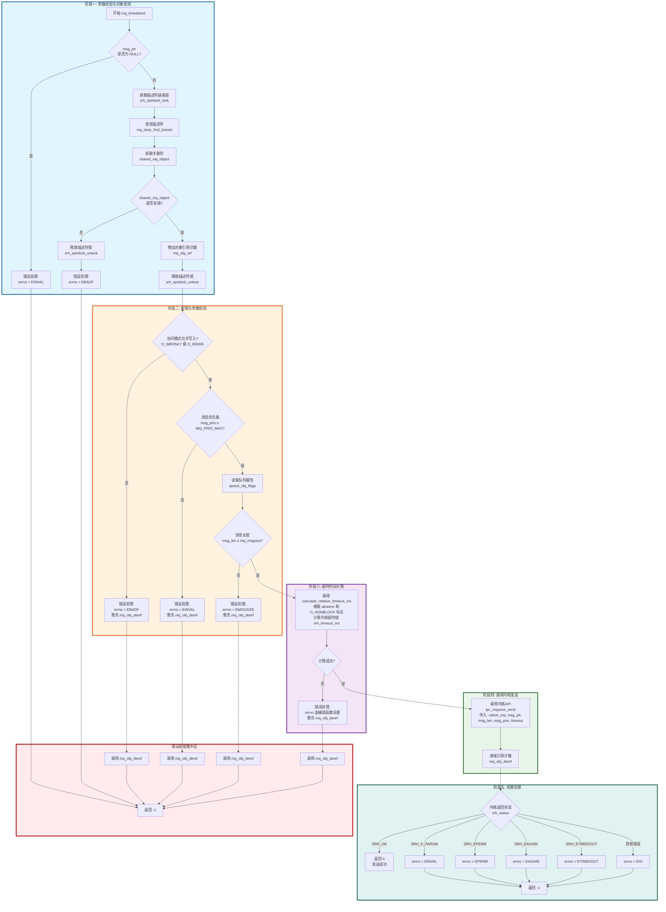


### 3.5`mq_timedrecive`

#### 1.API原型

```c
#include <mqueue.h>
#include <time.h>

ssize_t mq_timedreceive(mqd_t mqdes,
                        char *msg_ptr,
                        size_t msg_len,
                        unsigned int *msg_prio,
                        const struct timespec *abstime);
```

#### 2.参数说明

| 项目            | 描述                                                         |
| --------------- | ------------------------------------------------------------ |
| 函数功能        | 从 POSIX 消息队列中接收一条消息。当队列为空时，阻塞等待直到有新消息到达或到达指定的绝对超时时间。返回实际接收到的消息字节数。相比 `mq_receive`，提供了精确的超时控制能力。 |
| 参数 `mqdes`    | 由 `mq_open()` 返回的消息队列描述符，必须以读或读写模式打开。 |
| 参数 `msg_ptr`  | 接收消息数据的缓冲区指针。消息内容会从内核拷贝到该缓冲区中。 |
| 参数 `msg_len`  | 接收缓冲区大小（字节）。必须 ≥ 创建队列时指定的 `mq_msgsize`，否则调用失败（与 `mq_timedsend` 的 `msg_len` 含义不同，这里是缓冲区容量而非实际数据长度）。 |
| 参数 `msg_prio` | 可选参数。若非 `NULL`，内核会将接收到的消息的优先级值写入该指针指向的变量。若不需要优先级信息，可传 `NULL`。 |
| 参数 `abstime`  | 指向 `struct timespec` 的指针，指定绝对截止时间（CLOCK_REALTIME）。若当前时间已超过该值且队列仍为空，则立即返回超时错误。传 `NULL` 等价于无限阻塞（行为同 `mq_receive`）。 |
| 返回值          | 成功返回实际接收的消息字节数（`ssize_t`，非负值）；失败返回 `-1` 并设置 `errno`。注意：返回值可能小于 `msg_len`，表示消息实际长度。 |
| 错误码          | • `EAGAIN`：队列空且 `O_NONBLOCK` 模式，`abstime` 被忽略；<br />• `EBADF`：`mqdes` 无效或未以读权限打开；<br />• `EINTR`：阻塞期间被信号中断，需重试；<br />• `EINVAL`：`abstime` 中 `tv_nsec` < 0 或 ≥ 1e9；`EMSGSIZE`：`msg_len` < 队列的 `mq_msgsize`，缓冲区过小；<br />• `ETIMEDOUT`：到达 `abstime` 时队列仍无可用消息。 |
| 使用场景        | 实时系统中需要严格时限保证的消息接收；消费者端防止因队列空而无限期阻塞；需要获取消息优先级以做差异化处理的调度逻辑。 |

#### 3.实现流程

##### 1.实现流程简图

##### 2.详细实现流程图

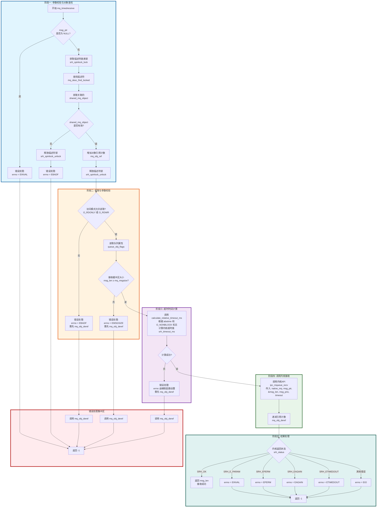

