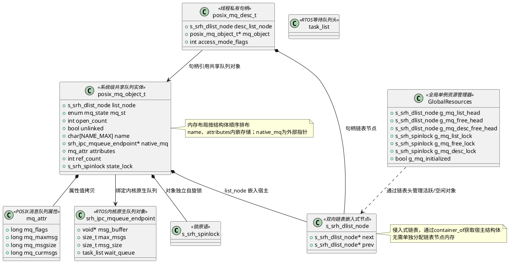

# 消息队列`mqueue`模块的详细设计

## 1.模块概述说明

用户使用场景/意义：

## 2.模块接口

### 2.1对外接口

| 接口名称                  | 功能描述          | 备注                                 |
| --------------------- | ------------- | ---------------------------------- |
| `mq_open`             | 打开或创建命名消息队列   | 支持 O_CREAT, O_EXCL, O_NONBLOCK 等标志 |
| `mq_close`            | 关闭消息队列描述符     | 减少引用计数，可能触发延迟销毁                    |
| `mq_unlink`           | 移除消息队列名称      | 标记删除，实际销毁推迟至最后描述符关闭                |
| `mq_send`             | 向消息队列发送消息（阻塞） | mq_timedsend 的无超时封装                |
| `mq_timedsend`        | 带超时的消息发送      | 核心发送实现，接受绝对超时时间                    |
| `mq_receive`          | 从消息队列接收消息（阻塞） | mq_timedreceive 的无超时封装             |
| `mq_timedreceive`     | 带超时的消息接收      | 核心接收实现，返回实际接收字节数                   |
| `mq_getattr`          | 获取消息队列当前属性    | 返回 flags, maxmsg, msgsize, curmsgs |
| `mq_setattr`          | 设置消息队列属性      | 仅允许修改 O_NONBLOCK 标志                |
| `_mqueue_module_init` | 模块初始化         | 初始化全局链表、锁及预分配对象/描述符池               |

### 2.2调用关系

## 3.模块设计原理

### 资源关系



### 3.1 mq_open

#### 1.api原型

```c
#include <mqueue.h>
#include <sys/stat.h>   /* For mode constants */
#include <fcntl.h>      /* For O_* constants */mqd_t 

mqt_t mq_open(const char *name, int oflag);

mqd_t mq_open(const char *name, int oflag, mode_t mode, struct mq_attr *attr);

eg:
mqd_t mqdes = mq_open(“test_mq”, O_CREAT | O_RDWR, 0x777, &attr);
```

#### 2.参数说明

| 项目         | 描述                                                                                                                                                                                                                                  |
| ---------- | ----------------------------------------------------------------------------------------------------------------------------------------------------------------------------------------------------------------------------------- |
| 函数功能       | 打开或创建一个 POSIX **命名**消息队列。返回一个消息队列描述符，用于后续的发送、接收及关闭操作。若指定了创建标志且队列不存在，则根据 `mode` 和 `attr` 创建新队列；若已存在且未指定排他标志，则直接打开。                                                                                                                   |
| 参数 `name`  | 消息队列名称字符串。不同进程通过相同名称访问同一队列。                                                                                                                                                                                                         |
| 参数 `oflag` | 操作标志位组合：<br>• `O_RDONLY`: 只读（仅接收）<br>• `O_WRONLY`: 只写（仅发送）<br>• `O_RDWR`: 读写<br>• `O_CREAT`: 队列不存在时创建,附加两个参数：mode和attr<br/>• `O_EXCL`: 配合 `O_CREAT` 使用，若队列已存在则失败<br>• `O_NONBLOCK`: 非阻塞模式：队列为空时的读和队列为满时的写不被阻塞。                      |
| 参数 `mode`  | 权限掩码（如 `0644`），仅在创建新队列时有效，定义队列文件的访问权限。                                                                                                                                                                                              |
| 参数 `attr`  | 指向 `struct mq_attr` 的指针，指定队列属性（最大消息数、最大消息大小、优先级等）。传 `NULL` 时使用系统默认值。仅在创建新队列时生效。                                                                                                                                                     |
| 返回值        | 成功返回消息队列描述符 (`mqd_t`)；失败返回 `(mqd_t)-1` 并设置 `errno`。                                                                                                                                                                                 |
| 错误码        | • EACCES: 权限不足或 name 格式非法<br/>• EEXIST: O_CREAT \| O_EXCL 下队列已存在<br/>• ENOENT: 未指定 O_CREAT 且队列不存在<br/>• EINVAL: name 无效、attr 中字段非法或超出系统限制<br/>• EMFILE/ENFILE: 进程或系统级描述符耗尽<br/>• ENAMETOOLONG: name 长度超限<br/>• ENOMEM: 内核内存不足无法创建队列 |
| 注意事项       | •编译命令包含 -lrt                                                                                                                                                                                                                        |
| 使用场景       | POSIX 进程间通信（IPC）中基于消息队列的数据交换；实时系统中任务间异步消息传递；需要持久化命名队列（内核级生命周期）的场景。                                                                                                                                                                  |

#### 3.具体实现（处理）流程


### 3.2mq_close


#### 1.api原型

#### 2.参数说明

#### 3.处理流程

#### 4.异常情况

### 3.3mq_unlink

#### 1. api原型

#### 2.参数说明

#### 3.处理流程

#### 4. 异常情况
